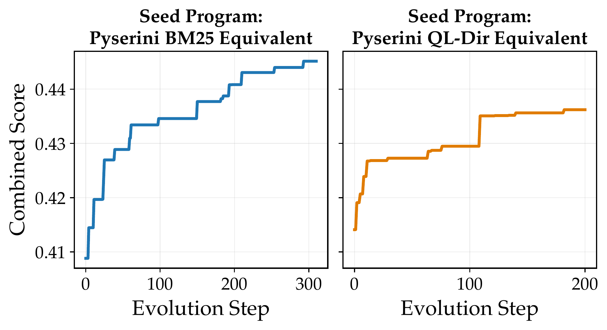

# RankEvolve

**Official implementation of the SIGIR 2026 short paper —**
[*RankEvolve: Automating the Discovery of Retrieval Algorithms via LLM-Driven Evolution*](https://arxiv.org/abs/2602.16932)

<sub>*<i>Jinming Nian, Fangchen Li, Dae Hoon Park, Yi Fang</i>*</sub>
<br>
<sub><i>Santa Clara University</i></sub>

---

<p align="center">
  
</p>

A modular framework for evolving retrieval algorithms with LLM-driven program
synthesis. The original paper studies BM25 discovery on BRIGHT and BEIR; this
repository generalises that workflow into a harness where every task — a seed
program, an evaluator, and configs — lives in its own folder under `tasks/`.

---

## Setup

```bash
# 1. Clone.
git clone https://github.com/jmnian/RankEvolve.git
cd RankEvolve

# 2. Install with uv (https://docs.astral.sh/uv/).
#    The lockfile is committed; uv sync gives you the exact pinned env.
uv sync

# 3. Configure secrets.
cp .env.example .env
$EDITOR .env       # fill in OPENAI_API_KEY (and ANTHROPIC_API_KEY if you use it)
```

`.env` is auto-loaded from the config's directory (walking up to the repo
root) before YAML `${VAR}` interpolation, so config files can reference
`${OPENAI_API_KEY}` without exporting it manually.

For larger experiments you may also want:

```bash
# Skip the heaviest BEIR / TREC-DL datasets during evolution.
export EVAL_EXCLUDE_DATASETS="dl19,dl20,fever,climate-fever,hotpotqa,dbpedia-entity,nq,quora,webis-touche2020,cqadupstack,leetcode,aops,theoremqa_questions,robotics,psychology,sustainable_living"
```

## Quickstart

```bash
# Sanity check: run the dashboard tests.
uv run ranking-evolved test-dashboard
# → reports/test_dashboard.html

# Drive an evolution loop on the latency-aware BM25 task (50 iterations).
uv run ranking-evolved run \
  --config tasks/bm25/configs/freeform_latency_aware.yaml \
  --replay --max-iterations 50

# Resume an in-progress run; --max-iterations is the total target.
uv run ranking-evolved run \
  --resume output/bm25_freeform_latency_aware/<run_id> \
  --max-iterations 200

# Render the per-step replay dashboard.
uv run ranking-evolved replay-dashboard --run output/bm25_freeform_latency_aware/<run_id>
```

Each invocation produces a self-contained run directory under
`output/<task>/<timestamp>_<short-hash>/` with `run.db` (SQLite source of
truth), `trace.jsonl` (streaming event log), `replay/step_NNNN.json`,
`baseline_latency.json`, `experiment_summary.json`, `plots/*.pdf`, `best/`,
`logs/`, and `manifest.json`.

## Repository layout

```
src/ranking_evolved/      framework: engine, search, proposers, prompts, evaluation, config
tasks/
├── bm25/                 active BM25 task (library + evaluator + seeds + configs)
├── ql/                   relocated only — not yet migrated; see tasks/ql/README.md
├── _shared/              dataset loaders + metrics shared across tasks
└── evolution_algo_test/  smoke fixture used by tests/test_smoke.py
tests/                    framework + library tests; record_io fixture feeds the dashboard
docs/                     architecture notes and figures
legacy/                   pre-restructuring code kept for provenance only — do not import
```

## Adding a task

A task is one folder under `tasks/` containing a seed program (the starting
candidate), an evaluator with the signature `evaluate(program_path) -> dict`,
an optional library of reusable code, and one or more YAML configs pointing
at the seed and evaluator. `tasks/bm25/` is the canonical example.

## Proposers and search strategies

| Component       | Plug-in point                                           | Built-ins |
| --------------- | ------------------------------------------------------- | --------- |
| Proposer        | `src/ranking_evolved/proposers/`                        | `openai_responses`, `anthropic`, `claude_code`, `codex`, `ensemble`, `scripted`, `fake` |
| Search strategy | `src/ranking_evolved/search/`                           | `map_elites_islands` (default) |
| Prompt builder  | `src/ranking_evolved/prompts/sampler.py`                | parent + inspiration + artifact context |
| Evaluator       | user-supplied `evaluate(program_path)` in a `tasks/` folder | — |

New proposers and strategies self-register via the registries in
`proposers/base.py` and `search/base.py`.


## Roadmap / next steps

### Short term

- [ ] **Encode remaining datasets** — `bright_stackoverflow` (107k docs) and
  `bright_theoremqa_questions` (188k docs) caches need to be generated so the
  full 3-dataset live re-eval can run. Use `--dataset bright:stackoverflow` etc.
- [ ] **Run more evolution iterations** — the current best was found in ~9h /
  50 iterations; longer runs with `--max-iterations 200` may surface better
  approximations.
- [ ] **Ablate objectives** — try recall-only and latency-only objectives as
  controls; compare against the current mixed objective (0.4/0.3/0.3).

### Baselines to compare

| Baseline | Notes |
|---|---|
| Seed program (ExactMaxSim) | Done — stored in `tasks/late_interaction/baselines/exact_maxsim.cpu.json` |
| BM25 (first-stage filter) | Classic two-stage: BM25 shortlist → MaxSim rerank |
| Single-vector dense (Qwen 4b) | No token interactions; much faster |
| GeminiEmbedding | |
| WARP | Fast approximate MaxSim; strong GPU baseline |

### Datasets to evaluate on

| Dataset | Status |
|---|---|
| BEIR (scifact, nfcorpus, arguana, scidocs, fiqa, trec-covid) | Cache encodable; fiqa done |
| BRIGHT (biology, earth_science, economics, stackoverflow, theoremqa) | Cache encodable; none done yet |
| [Bright-Pro](https://huggingface.co/datasets/yale-nlp/Bright-Pro) | Not yet integrated |
| Lotte | Not yet integrated |
| [Obliq](https://arxiv.org/abs/2605.06235) | Not yet integrated |
| [ViDoRe](https://arxiv.org/pdf/2601.08620) | Multimodal; requires separate encoder |

### Framework improvements

- [ ] **QL task migration** — files in `tasks/ql/` carry "STATUS: NOT YET
  MIGRATED"; port them to the current evaluator interface.
- [ ] **Multi-model proposer experiment** — compare open-source LLM proposers
  against GPT-4o / Claude for program generation quality.
- [ ] **Structured diff format** — evaluate whether SEARCH/REPLACE diffs vs
  full-file rewrites affect convergence speed.

---

## Citation

```bibtex
@misc{nian2026rankevolveautomatingdiscoveryretrieval,
  title         = {RankEvolve: Automating the Discovery of Retrieval Algorithms via LLM-Driven Evolution},
  author        = {Jinming Nian and Fangchen Li and Dae Hoon Park and Yi Fang},
  year          = {2026},
  eprint        = {2602.16932},
  archivePrefix = {arXiv},
  primaryClass  = {cs.IR},
  url           = {https://arxiv.org/abs/2602.16932},
}
```

## License

See [LICENSE](LICENSE).
